

 

  

<a href="https://x.com/joel_depin"><b>Follow on X</b></a> &nbsp;·&nbsp; <a href="#selected-work"><b>Selected work</b></a> &nbsp;·&nbsp; <a href="#building"><b>Building</b></a>

## Selected work

Every project below runs locally for free, with a demo mode that needs no API keys, and has an offline test suite.

<table>
<tr>
<td colspan="2" align="center">
<a href="https://github.com/joel819/docs-rag-chatbot">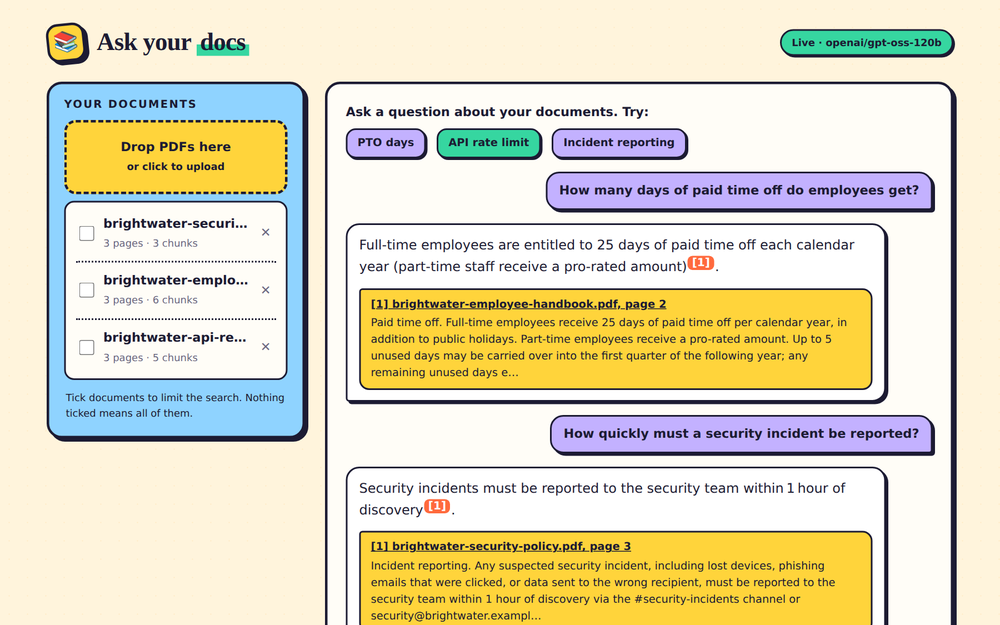</a>
  
<h3><a href="https://github.com/joel819/docs-rag-chatbot">docs-rag-chatbot</a></h3>
Answers questions over company documents, with citations to the source page. Click a citation and the PDF opens at that page. A question the documents don't cover gets an honest "I couldn't find that" instead of a guess.
 <b>FastAPI · ChromaDB · RAG · sentence-transformers · Groq</b>
  
</td>
</tr>
<tr>
<td colspan="2" align="center">
<a href="https://github.com/joel819/product-data-extractor">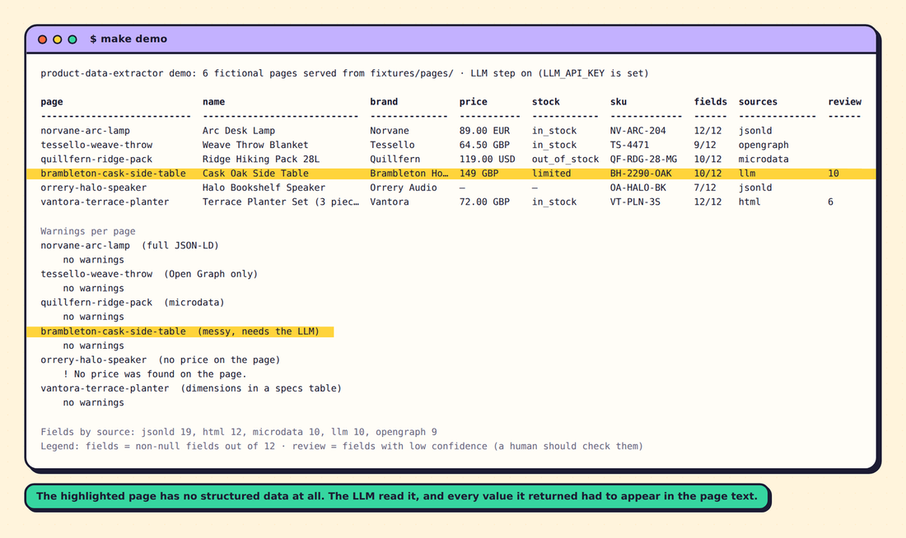</a>
  
<h3><a href="https://github.com/joel819/product-data-extractor">product-data-extractor</a></h3>
Paste a product page URL, get clean structured product data back, and optionally auto-fill a Google Sheets row. It reads the standard markup shops already publish (JSON-LD, Open Graph, microdata) and only asks an LLM for what is still missing, keeping only values that appear in the page text. Anything not found stays empty, and every field says where it came from and how much to trust it.
 <b>FastAPI · schema.org · SSRF-safe fetching · LLM fallback · Google Sheets (Apps Script)</b>
  
</td>
</tr>
<tr>
<td colspan="2" align="center">
<a href="https://github.com/joel819/catalog-chat-assistant">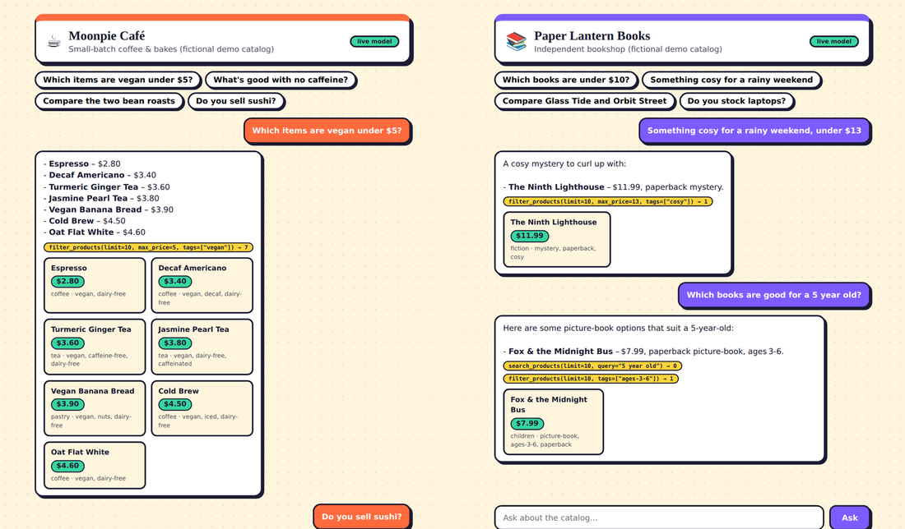</a>
  
<h3><a href="https://github.com/joel819/catalog-chat-assistant">catalog-chat-assistant</a></h3>
A multi-tenant chat assistant that answers only from a business's own product catalog: recommendations, comparisons and "which items are vegan under $5?" lookups. The model works through search, filter and lookup tools instead of being handed the catalog, a question the catalog can't answer gets an honest "not in our catalog", and one shop can never see another's products.
 <b>FastAPI · tool calling · ChromaDB · sentence-transformers · multi-tenant · Groq</b>
  
</td>
</tr>
<tr>
<td width="50%" valign="top">
<a href="https://github.com/joel819/web-flow-bot">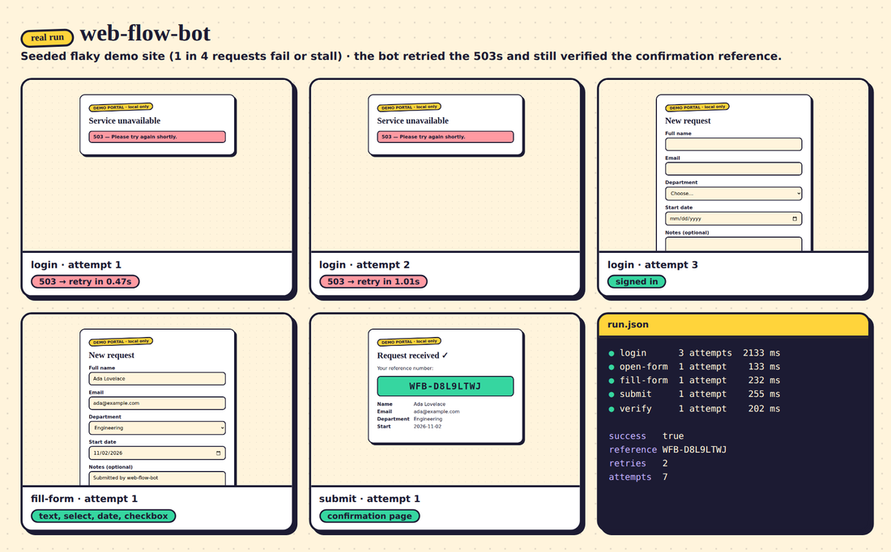</a>
 
<h3><a href="https://github.com/joel819/web-flow-bot">web-flow-bot</a></h3>
Playwright bot that logs in, fills a multi-field form, submits it and verifies the confirmation reference number. Per-step retries with backoff, a screenshot of every attempt and a JSON run log. Runs against a local demo site that can fail on purpose.
 <b>Playwright · FastAPI · retries · Docker · pytest</b>
</td>
<td width="50%" valign="top">
<a href="https://github.com/joel819/llm-cost-router">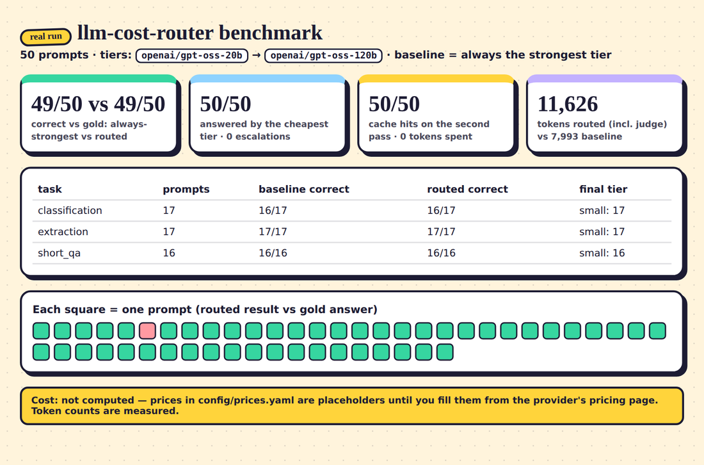</a>
 
<h3><a href="https://github.com/joel819/llm-cost-router">llm-cost-router</a></h3>
Sends each prompt to the cheapest model that passes a quality check, escalates only on failure, caches repeats and logs cost per request. Prices come from config, never guesses, and the benchmark reports only what a real run measured.
 <b>OpenAI-compatible APIs · Groq · routing · caching · benchmark</b>
</td>
</tr>
<tr>
<td width="50%" valign="top">
<a href="https://github.com/joel819/support-agent">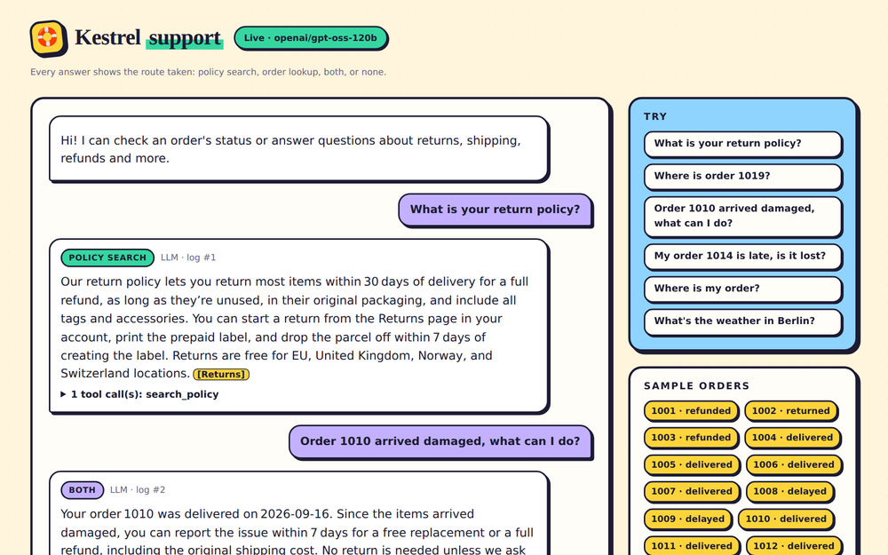</a>
 
<h3><a href="https://github.com/joel819/support-agent">support-agent</a></h3>
Support agent that combines document search with live order lookups via tool calling. Every answer shows the route it took and the exact tool calls behind it.
 <b>FastAPI · tool calling · RAG · routing log</b>
</td>
<td width="50%" valign="top">
<a href="https://github.com/joel819/invoice-extractor">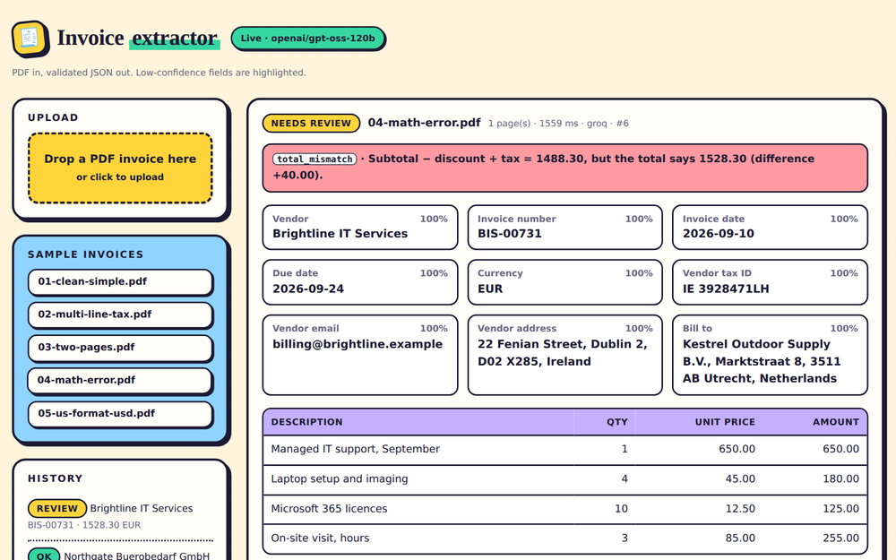</a>
 
<h3><a href="https://github.com/joel819/invoice-extractor">invoice-extractor</a></h3>
Turns messy PDF invoices into validated structured JSON through a FastAPI endpoint. Confidence on every field, and arithmetic errors are flagged for review, never silently fixed.
 <b>FastAPI · Pydantic · LLM extraction · validation</b>
</td>
</tr>
<tr>
<td width="50%" valign="top">
<a href="https://github.com/joel819/fastapi-saas-backend">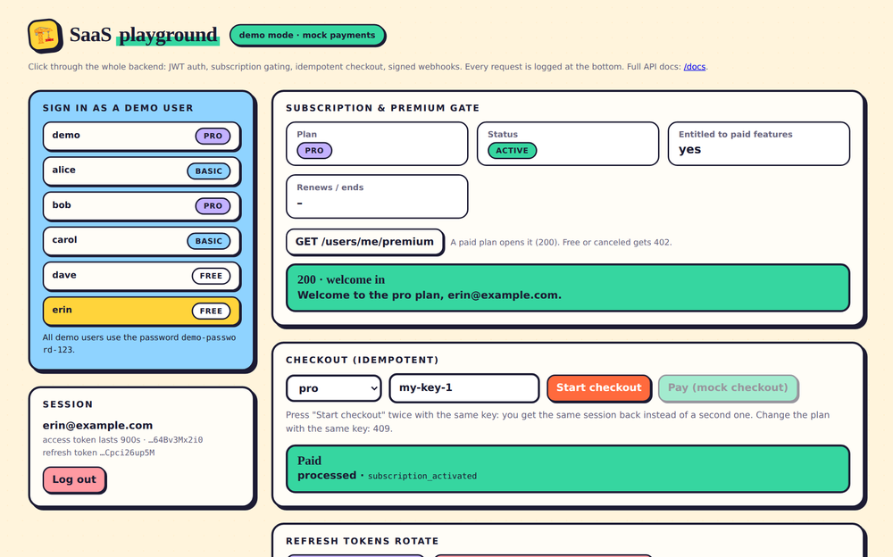</a>
 
<h3><a href="https://github.com/joel819/fastapi-saas-backend">fastapi-saas-backend</a></h3>
Production-style backend: JWT auth with rotating refresh tokens, subscriptions, verified and idempotent Stripe webhooks, rate limiting and a full test suite.
 <b>FastAPI · JWT · Stripe webhooks · SQLAlchemy</b>
</td>
<td width="50%" valign="top">
<a href="https://github.com/joel819/mcp-server-template">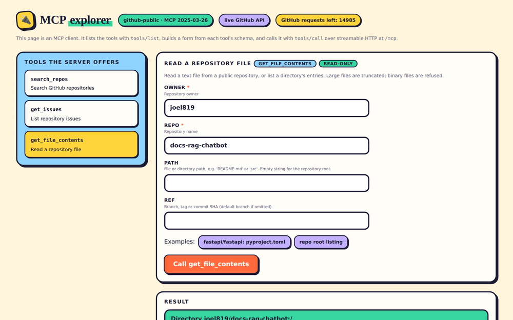</a>
 
<h3><a href="https://github.com/joel819/mcp-server-template">mcp-server-template</a></h3>
MCP server exposing a real API so any agent can use it as a tool. Streamable HTTP and stdio from one definition, with a built-in explorer page.
 <b>MCP · GitHub API · streamable HTTP · stdio</b>
</td>
</tr>
<tr>
<td width="50%" valign="top">
<a href="https://github.com/joel819/agent-spend-guard">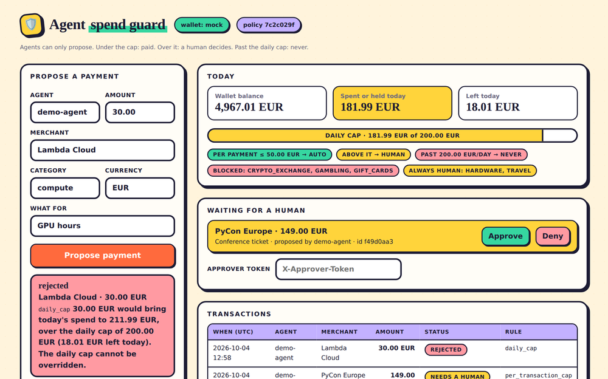</a>
 
<h3><a href="https://github.com/joel819/agent-spend-guard">agent-spend-guard</a></h3>
Spend limits and human approval for AI agents that handle funds. Auto-approve under a cap, a human decides above it, a hard reject at the daily limit, all in a tamper-evident audit log.
 <b>FastAPI · SQLite · policy as config · audit log</b>
</td>
<td width="50%" valign="top">
<a href="https://github.com/joel819/sandboxed-agent">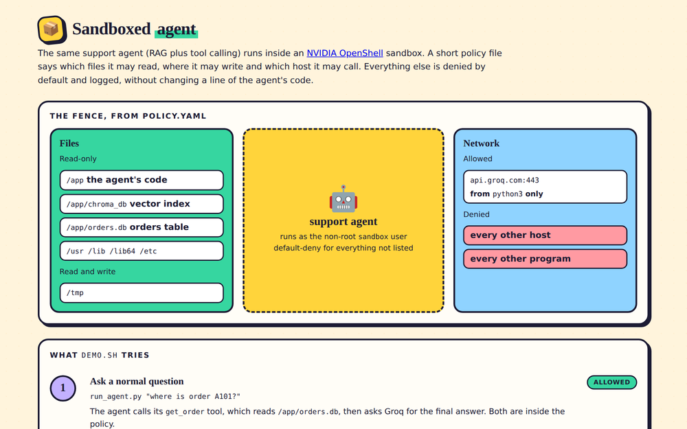</a>
 
<h3><a href="https://github.com/joel819/sandboxed-agent">sandboxed-agent</a></h3>
Runs support-agent inside an NVIDIA OpenShell sandbox: policy-restricted file and network access, with everything outside the allow-list blocked and logged.
 <b>NVIDIA OpenShell · policy as code · Docker</b>
</td>
</tr>
</table>

## How I build

<table>
<tr>
<td width="33%" valign="top">
<b>Free to run</b> 
Each project has a demo mode that works with no API keys, so anyone can clone it and see it working in a minute.
</td>
<td width="33%" valign="top">
<b>Tested offline</b> 
Test suites that need no keys, no model download and no network, so they run anywhere.
</td>
<td width="33%" valign="top">
<b>Honest about failure</b> 
Low-confidence flags instead of silent fixes, hard rejects with the numbers, "I couldn't find that" instead of a guess.
</td>
</tr>
</table>

## Building

**SoverGrid**: a routing layer for decentralized compute.

## Contact

[X (@joel_depin)](https://x.com/joel_depin)
